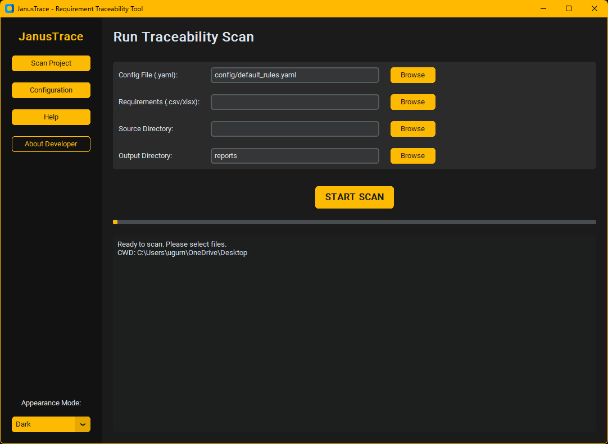
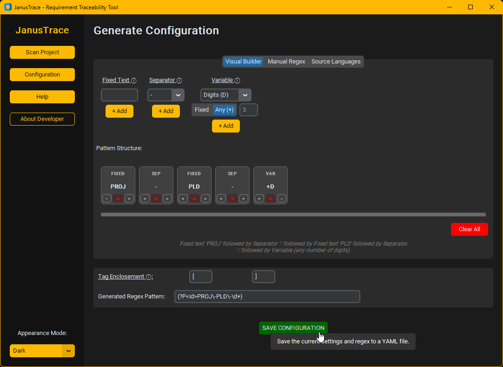
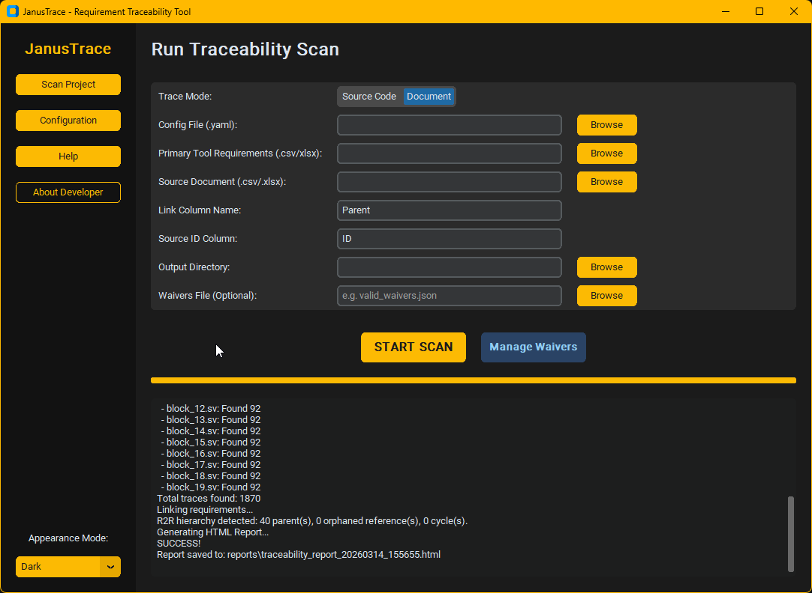
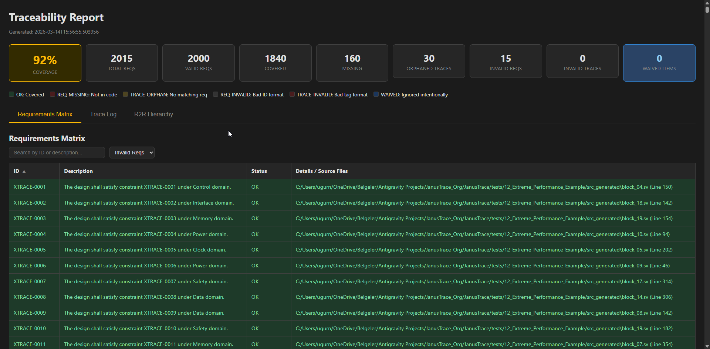
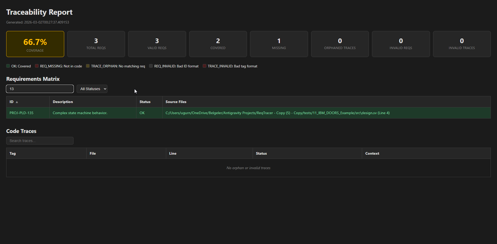

# JanusTrace
A requirement-code traceability tool to support requirement-based development efforts, especially for safety-critical flows such as DO-254, DO-178C, or ISO 26262.

This tool does not strictly guarantee the trace reports generated would be working fully-compliant with safety standards. Thus, the corresponding tool qualification criteria shall be satisfied. However, the test suite to be released should significantly support the tool qualification stage.

This project has been built and tested with several LLMs and agentic AIs (ChatGPT 4.5, Gemini 3.1 Pro, Claude 4.6 Opus, Google Antigravity)

The following are tested and will be uploaded soon:
- Python source files,
- User example test cases,
- Pytest unit tests suite,
- Build script for Windows,

The following require more testing and should be uploaded in a reasonable time:
- Build script for Linux,
- Linux executable,
- Git workflows.

