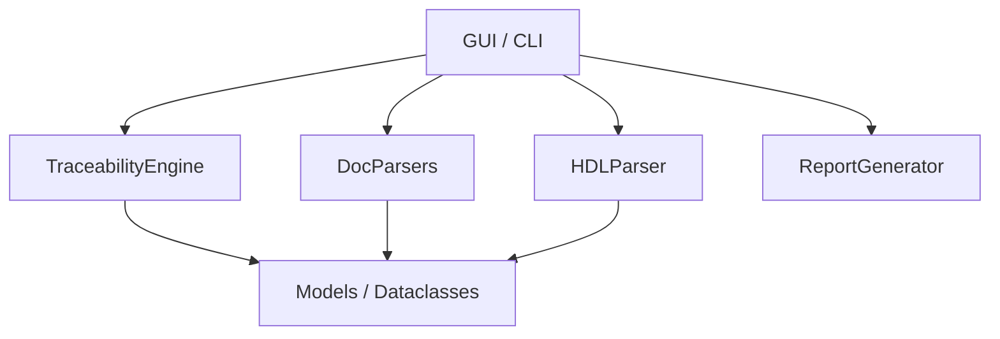

# Software Architecture

JanusTrace is built as a modular Python package aimed at high-performance scanning and robust data linking.

## Package Structure

The core logic resides in the `trace_framework/` package:

### 1. `core` Module
-   **models.py**: Contains `Requirement` and `TraceObject` immutable dataclasses used as the primary data exchange format.
-   **engine.py**: The central linking logic.
    -   `link()`: Correlates raw requirements with extracted traces.
    -   `link_r2r()`: Builds hierarchical parent-child relationships.

### 2. `parsers` Module
-   **doc_parsers.py**: Handles ingestion of CSV/Excel files. It uses a base `TabularDocumentParser` class to unify column mapping and coordinate parsing.
-   **hdl_parsers.py**: The tag scanner. It iterates through directory trees, identifies files by extension, and uses language-specific comment rules to extract regex matches.

### 3. `utils` Module
-   **report_gen.py**: Responsible for generating the standalone HTML report. It serializes the engine's results into a JSON blob and embeds it into a pre-styled HTML template.
-   **regex_builder.py**: Translates user-friendly configuration fields (Prefix, Digits, etc.) into compiled Python regular expressions.

## Data Flow

1.  **Ingestion**: `DocParsers` read the requirement spreadsheet.
2.  **Scan**: `HDLParser` scans the source code directory for tags matching the `RegexBuilder` pattern.
3.  **Link**: `TraceabilityEngine` performs an ID-to-ID join between requirements and traces.
4.  **Enrich**: Hierarchies and waivers are applied to the linked dataset.
5.  **Export**: `ReportGenerator` produces the final HTML and JSON artifacts.

## Threading Model

To maintain a responsive UI, JanusTrace offloads the engine's heavy lifting to a background thread.

### `JanusTraceApp.run_scan_thread`
-   **Execution**: Triggered by the "Start Scan" button.
-   **Worker**: A `threading.Thread` instance calls `self.run_logic()`.
-   **Safety**: All UI modifications (progress bar, console logging) are marshalled back to the main thread using `self.after(0, func)`. This prevents "Main thread not in main loop" errors and application freezes.

## Internal Data Structures

### `ResultsContainer` (Dictionary)
This is the primary object returned by `TraceabilityEngine.link()`. It contains:
-   `requirements`: List of `Requirement` objects with updated `status`.
-   `traces`: List of `TraceObject` objects.
-   `invalid_reqs`: List of IDs that failed regex validation.
-   `orphans`: `TraceObject`s that don't map to any requirement.
-   `invalid_traces`: `TraceObject`s with malformed tags.
-   `waived_items`: Dictionary mapping ID -> Waiver Reason.
-   `stats`: Dictionary with coverage %, counts, etc.

### `ValidationStatus` (Enum)
Found in `core/engine.py`. Defines the state of any requirement:
-   `VALID`: Satisfied by at least one trace.
-   `MISSING`: Present in spreadsheet but not in code.
-   `INVALID`: malformed ID.
-   `WAIVED`: Manual override applied.

[Next: Testing Suite](./testing.md) | [Back to Home](../index.md)
