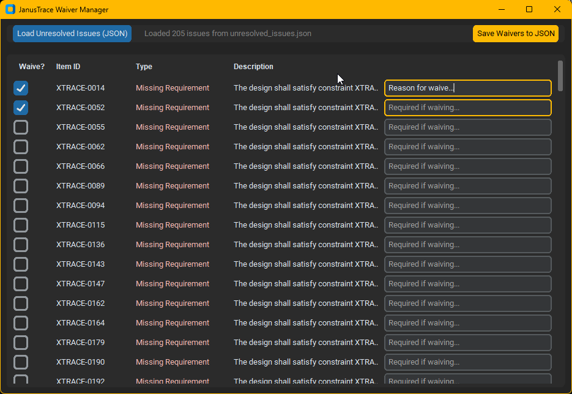

# Waiver Management

In real-world engineering, not every requirement can be traced directly to a code line. There may be false positives, legacy code sections that don't follow the current tagging standard, or high-level requirements that are simply "informed" rather than implemented.

JanusTrace allows you to "Waive" these items professionally so they don't lower your coverage metrics or clutter your reports with errors.

## The Waiver Workflow

1.  **Run a Initial Scan**: Run the tool normally. JanusTrace will generate an `unresolved_issues.json` file in your `reports/` folder.
2.  **Open Waiver Manager**: Click the **Manage Waivers** button on the main GUI screen.
3.  **Load Issues**: In the new window, browse to your `unresolved_issues.json`.
4.  **Mark Items**: For each issue you want to ignore:
    -   Check the **Waive?** box.
    -   Enter a **Waiver Reason** (e.g., "Requirement covered by manual test procedure XYZ").
5.  **Save Waivers**: Click **Save Waivers to JSON**. This will produce a `valid_waivers.json`.
6.  **Apply to Next Scan**: In the main GUI form, select your `valid_waivers.json` in the **Waivers File** input.



## Reporting Impact

When waivers are active:
-   **Status Change**: Requirements/Traces change from `REQ_MISSING` or `REQ_INVALID` to `WAIVED`.
-   **Visual Indicator**: In the HTML report, these rows appear in **Blue**.
-   **No Penalty**: Waived items count as "Satisfied" for coverage percentage calculation.
-   **Documentation**: The provided "Waiver Reason" is displayed directly in the Details column of the report.

## Technical Schema

For automation or batch processing, you can create waiver files manually using the following JSON structures.

### `unresolved_issues.json` (Input)
This file is produced by JanusTrace after a scan. It is a flat list of objects:
```json
[
  {
    "id": "REQ-001",
    "type": "Missing Requirement",
    "description": "Requirement not found in source code."
  }
]
```

### `valid_waivers.json` (Output)
This is the file expected by the engine. It is a dictionary where the **Key** is the Requirement ID and the **Value** is the reason string:
```json
{
  "REQ-001": "Manual verification performed in Test-Lab-01 on 2026-03-01."
}
```

[Next: Navigating Reports](./reports.md) | [Back to Home](../index.md)
